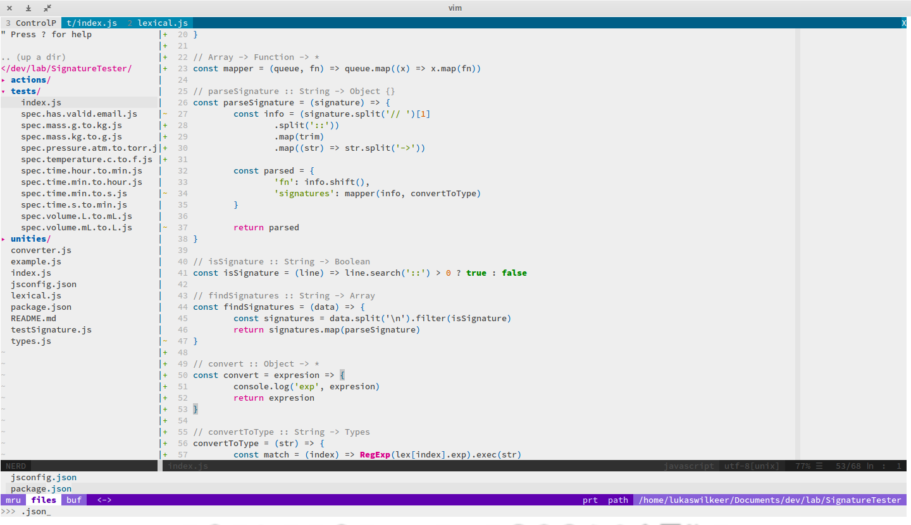

### O que?

Configurações do vim/Nvim

### Como é?

[Isso aqui](http://www.vim.org/)

### Tá bonito?

Tô não.

### To do:
- [ ] Adicionar créditos e link das libs.
- [ ] Melhorar o remapeamento e os atalhos.
- [ ] Alguma coisa que vou lembrar em alguma hora.
